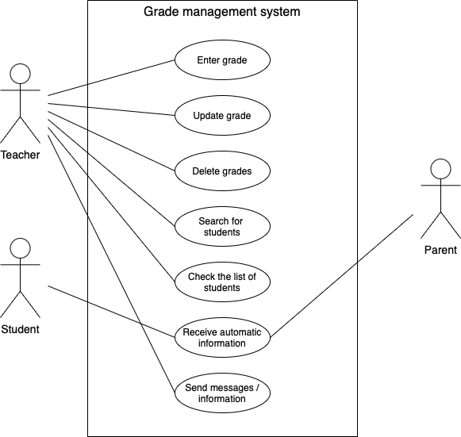

# Grade-management-system

**Project description**
A grade management system will be created to allow teachers to better manage the grades of their students. On the other hand the system will be helpful for students and parents as well, since they will get automatic information each month, while the teacher can also send specific messages or information when needed. 

**User Stories**
- As a teacher I want to be able to enter and update the grades of the student, so that each students can have his or her grades and the parents can be informed

- As a student, I want to receive automatic information about myself, so that I can know where to improve myself.

- As a teacher I want to  have lists of all the students and their grades and to be able to search of them, so that it can be easier to navigate.

- As a parent I want to recieve automatic information about my kid every month, so that I can be regularly informed about my kid.

-> As a teacher I want to be able to send messages/information to a student/parent so that I can inform them about a specific thing.

